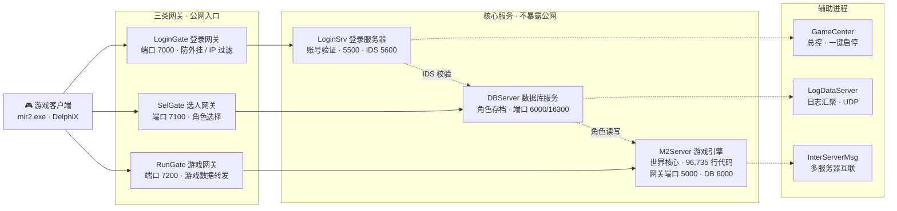

# Legend of Mir 2 · 全栈源码分析

*Project Analysis Report · 2026-09*

**Pascal / Delphi 6** · **服务端 7 程序 + 网关 3 程序** · **GPL-3.0 开源** · **客户端 DirectX 渲染** · **445,263 行 Pascal 代码**

本仓库是经典 MMORPG **《热血传奇》（Legend of Mir 2）**的**完整服务端 + 客户端** Delphi 源码工程， 版本为 **仿盛大 1.5「虎卫传说」复古珍藏版**。整个游戏从账号登录、角色存档、网关转发、游戏世界引擎到 DirectX 渲染客户端，全部源码齐备、可独立编译构建。

## 📑 目录

- [01 · 项目概览（Overview）](#overview)
- [02 · 系统架构（Architecture）](#arch)
- [03 · 模块解析与代码规模（Modules & Codebase）](#modules)
- [04 · 核心技术剖析（Deep Dive）](#tech)
- [05 · 「虎卫传说」复古版改动说明（Version Notes）](#version)
- [06 · 构建与运行（Build Guide）](#build)
- [07 · 技术债务与风险评估（Risks & Debt）](#risk)
- [08 · 总体评价（Conclusion）](#conclusion)

**相关文档**：[开发计划书](mir2-java-development-plan.md) · [Java 迁移可行性评估](mir2-java-migration-feasibility.md)

---

<a id="overview"></a>

## 01 · 项目概览（Overview）

- **445,263** — Pascal 源码总行数（含组件）
- **375 .pas** — Pascal 单元文件 · 另有 87 个窗体 .dfm
- **10 个** — 可执行程序（服务端 9 + 客户端 1）
- **~32 万行** — 自研业务代码（221 个单元）

- **57** — 怪物 AI 类（面向对象继承体系）
- **59** — 职业技能定义（战/法/道三系）
- **216** — SM_ 服务器消息协议号
- **137+** — 核心类定义（引擎 + 公共库）

> [!IMPORTANT]
> **这是什么项目？** 这是 2000 年代初韩国 Wemade 开发、盛大理睬大名的 2D MMORPG《热血传奇 2》的 Delphi 全套源代码流传版本，经社区作者 **Cola PI** 修改为「仿盛大 1.5 虎卫传说 · 2002 复古珍藏版」。 仓库内含从 `D:\GameOfMir` 工作目录完整迁移的工程：10 个 Delphi 工程（.dpr）、公共库、第三方组件、 以及一套可直接部署的服务端运行时（MirServer 目录）。

| 属性 | 值 | 属性 | 值 |
| --- | --- | --- | --- |
| 仓库 | `ivanmissu/MIR2` | 主语言 | Pascal（Delphi 6 方言） |
| 许可证 | `GPL-3.0` | 客户端数据版本 | 1.5 / 1.7.6 |
| 提交历史 | 单提交 `98711da`（davylin，2023-04-16） | 源码编码 | GBK / ANSI（非 UTF-8） |
| 游戏版本 | 仿盛大 1.5「虎卫传说」复古版 | 目标平台 | Windows（WinSock + DirectDraw） |

<a id="arch"></a>

## 02 · 系统架构（Architecture）

经典传奇采用**「网关隔离 + 多进程分工」**的分布式服务端架构：核心服务（登录、数据库、游戏引擎）不直接暴露给公网，客户端所有流量均经三类网关中转，配合 DES 加密与 IP 过滤实现安全防护。GameCenter 作为总控统一启停全部进程。



> 🔐 全网关链路：DES 对称加密 + EDcode 自定义编码 + 包头校验

1. **① 账号登录**：客户端 → LoginGate `:7000` → LoginSrv 验证账号密码
2. **② 选择服务器**：LoginSrv 下发服务器列表 客户端选定大区
3. **③ 角色选择**：→ SelGate `:7100` → DBServer 创建 / 删除 / 选择角色
4. **④ 进入世界**：→ RunGate `:7200` → M2Server 游戏主循环开始

> [!NOTE]
> **设计洞察：**「网关（Gate）层」是这套 2001 年架构的精华——网关只做协议转发、IP 黑名单、连接数限制和流量过滤， 让核心服务与公网完全隔离；同时 RunGate 可横向部署多个（配置中已预留 GatePort1=7200 等），天然具备最朴素的负载均衡能力。 这与今天游戏行业的「接入层 / 逻辑层 / 存储层」三层分离思想完全一致。

<a id="modules"></a>

## 03 · 模块解析与代码规模（Modules & Codebase）

仓库根目录 `GameOfMir/` 下共 15 个子目录。以下为各模块 Pascal 代码规模（不含窗体 .dfm 资源）：

| 模块 | 代码规模 | 代码行数 |
| --- | :--- | ---: |
| Component 第三方组件 | ████████████████████ | 127,498 行 |
| M2Server 游戏引擎 | ███████████████ | 96,735 行 |
| MirClient 客户端 B | ██████████████ | 88,722 行 |
| Client 客户端 A | ██████████████ | 87,036 行 |
| Common 公共库 | █ | 7,497 行 |
| GameCenter 总控 | █ | 6,652 行 |
| LoginSrv 登录服务 | █ | 6,496 行 |
| DBServer 数据库服务 | █ | 8,974 行 |
| RunGate 游戏网关 | █ | 4,537 行 |
| SelGate / LoginGate | █ | 3,907 ×2 行 |
| LogDataServer 日志 | █ | 3,216 行 |

### M2Server —— 游戏世界引擎（61 单元 / 96,735 行）

整个游戏的心脏。以 `svMain` 为主窗体，`UsrEngn` 驱动主循环，`ObjBase` 定义全部对象的基类行为（移动、战斗、掉落、消息队列），`ObjNpc` 实现 NPC 脚本引擎与商人系统，`Castle`/`Guild` 实现沙巴克攻城与行会，`LocalDB` 加载怪物/物品/技能数据库，`Envir` 管理地图与寻路。

### Client / MirClient —— 双客户端（77 单元 / 17.6 万行）

基于 **DelphiX + DirectDraw** 的 2D 引擎：`ClMain` 主循环、`Actor` 角色动画状态机、`WIL.pas` 解析传奇专用 WIL/WZL 图库资源、`DXRender` 负责渲染、`SoundUtil` 音效。两个目录是同一客户端的两个修改分支（23 个文件存在差异），MirClient 附带 `MirGame.dpk` 组件包。

### Common / SDK —— 公共协议层（10 单元 / 7,583 行）

`Grobal2.pas` 是客户端与服务端共享的**协议宪法**：216 个 SM_ 消息号、CM_ 命令号、装备槽位、坐标系（48×32 逻辑格）；`DES.pas`/`EDcode.pas` 负责通信加密编码；`HUtil32`/`MudUtil` 提供工具函数。SDK.pas 为网关间共享的最小接口单元。

### 三大网关 + 辅助服务（合计约 1.9 万行）

LoginGate(7000)/SelGate(7100)/RunGate(7200) 结构相同：ServerSocket 接客户端、ClientSocket 连内网服务，内置 IP 过滤、连接限速、消息缓冲。GameCenter 总控可一键按依赖顺序拉起全部进程；LogDataServer 通过 UDP 汇聚全服日志；LoginSrv 管理账号库(IDDB)与会话。

| 巨型文件 Top 8 | 行数 | 所属模块 | 职责 |
| --- | ---: | --- | --- |
| `M2Server/ObjBase.pas` **单文件 2.7 万行** | 26,821 | 服务端 | 全部游戏对象的基类：TBaseObject 生命周期、战斗公式、视野、消息队列 |
| `Client/DirectX.pas` | 15,995 | 客户端 | DirectX 7 API 的 Pascal 翻译层（DirectDraw/DSound/DInput） |
| `M2Server/ObjNpc.pas` | 11,556 | 服务端 | NPC 与脚本引擎：商人买卖/修理、传送、任务对话 |
| `M2Server/M2Share.pas` | 11,087 | 服务端 | 引擎全局配置与共享数据结构 |
| `Client/DXRender.pas` | 8,081 | 客户端 | 渲染管线：地图、精灵、光照、特效合成 |
| `Client/FState.pas` | 6,831 | 客户端 | 角色状态 UI：背包/装备/技能/交易界面 |
| `Client/ClMain.pas` | 6,500 | 客户端 | 客户端主窗体与网络消息分发 |
| `M2Server/LocalDB.pas` | 3,670 | 服务端 | 怪物/物品/技能数据库的加载与索引 |

<a id="tech"></a>

## 04 · 核心技术剖析（Deep Dive）

### ① 面向对象的对象体系（服务端）

引擎以经典 OOP 继承树组织**一切可见对象**，57 个怪物类、6 个 NPC 类、玩家/守卫/机器人共 70+ 类共享同一基类：

```
// M2Server/ObjBase.pas 等单元
TBaseObject          // 基础对象：坐标/生命/消息队列
 └─ TAnimalObject    // 可行动对象：移动/AI 框架
     ├─ TPlayObject  // 玩家（网络会话绑定）
     │   ├─ TPlayCloneObject  // 分身
     │   └─ TRobotObject // 机器人（假人）
     ├─ TMonster → 57 个具体怪物类
     │   （TScorpion / TCowKingMonster /
     │    TArcherGuard / TCastleDoor …）
     └─ TNormNpc    // NPC
         ├─ TMerchant  // 商人（买卖/修理/收购）
         ├─ TGuildOfficial  // 行会管理
         └─ TSuperGuard  // 超级守卫
```

每种怪物通过覆写 `Attack`/`Run`/`Operate` 实现专属 AI：沃玛教主的召唤、触龙神的钻地、祖玛雕像的苏醒、沙巴克城门与箭塔均为独立子类。

### ② 自定义二进制网络协议

客户端-服务端通信为紧凑的自定义二进制协议，消息号统一定义于共享单元 `Common/Grobal2.pas`：

```
// 客户端 → 服务器（节选）
CM_QUERYCHR     = 100;  // 查询角色列表
CM_DROPITEM     = 1000; // 丢弃物品
CM_PICKUP       = 1001; // 拾取
CM_MERCHANTDLGSELECT = 1011; // NPC 对话选项
CM_USERSELLITEM = 1013; // 出售物品
CM_DEALTRY      = 1025; // 开始交易
// 服务器 → 客户端：SM_ 前缀共 216 个消息号
```

消息以 `标准头 + 定长记录体` 封装（DEFBLOCKSIZE=16），网关转发前后各做一次**DES 加密 + EDcode 编码**（Common/DES.pas 为标准 DES 实现），客户端版本号校验 `CLIENT_VERSION_NUMBER` 防止跨版本混连。

### ③ 客户端：DelphiX 游戏引擎

客户端基于社区著名的 **DelphiX** 组件库（仓库 Component/ 内含完整源码 + Demos/Help），直连 DirectX 7：

- **渲染：**DirectDraw 独占/窗口模式，48×32 逻辑网格、24×16 半格碰撞，斜 45° 俯视角
- **资源：**WIL/WZL 专用图库格式（`WIL.pas` 的 TWMImage 组件，需先安装 MirGame.dpk）
- **动画：**`Actor.pas` 按 8 方向 × 动作状态机播放精灵序列；`magiceff.pas` 魔法特效
- **音频：**DirectSound + Mpeg/DShow 单元支持背景音乐与音效
- **UI：**自绘控件 DWinCtl + Delphi VCL 窗体混合（FState 状态界面）

### ④ 游戏玩法系统（服务端）

- **三职业体系：**战士/法师/道士 59 个技能（SKILL_ 常量），技能等级上限 3 级
- **装备系统：**10 个穿戴槽位（衣/武/右镯/项链/盔/双镯/双戒/护身符），物品 46 格背包
- **沙巴克攻城：**Castle/CastleManage 单元——城门、城墙、箭塔均为可破坏对象
- **行会系统：**Guild.pas 行会创建/战争/同盟
- **NPC 脚本：**Mission.pas 解析商家脚本，支持收购/出售/修理/传送/任务对话
- **组队/交易/摆摊：**CM_GROUPMODE、CM_DEAL* 系列消息支撑
- **怪物刷新：**ConfigMonGen 可视化配置刷怪点（MonGen）

<a id="version"></a>

## 05 · 「虎卫传说」复古版改动说明（Version Notes）

仓库内 `版本介绍.txt` 记录了该修改版相对原版引擎的 30+ 项变更，核心思路是**「做减法，还原 2002 年复古体验」**：

### ➖ 砍掉的现代化功能

- ❌ 结婚系统及 MARRY/UNMARRY 等 8 条脚本指令
- ❌ 师徒系统及 MASTER 等 10 条脚本指令
- ❌ 彩票功能
- ❌ 赌博系统（掷骰子 BATCHDELAY/ADDBATCH）
- ❌ 引擎对客户端的强校验

### 🔧 修复的引擎缺陷

- ✅ 卖物品给 NPC 时价格错乱（-1 价）
- ✅ 捡书类型错误、删除角色后计数错误
- ✅ 交易 NPC 配置保存会重写整份文件、丢注释
- ✅ 读 UTF-8 配置文件异常（现支持 ANSI/Unicode/UTF-8）
- ✅ 道士神兽瞬移时屏幕残影

### ✨ 体验增强

- ✅ 人物升级增加发光特效
- ✅ 小地图光点按队友/宠物分色显示
- ✅ 超重/背包满时明确提示
- ✅ 城堡管理功能完善、界面美化
- ✅ 调整诱惑之光成功率与宠物叛变时间

<a id="build"></a>

## 06 · 构建与运行（Build Guide）

### 开发环境要求（来自 README / doc）

- **Delphi 6.0**（2001 年 Borland IDE，硬性要求——代码用了 D6 方言与旧 RTL）
- 安装 **JSocket** 组件（WinSock 的阻塞式 Socket 封装，Jacky.dpk）
- 安装 **DelphiX for Delphi6**（DelphiX60.dpk，DirectX 游戏组件）
- 安装 **TWMImage** 组件（WIL.pas，传奇图库读取）
- 工程约定工作目录 `D:\GameOfMir`（单元以相对路径 `..\Common\xxx.pas` 互相引用）

### 开箱即用的部署包

`MirServer/` 目录是一套**已编译好的完整服务端**：M2Server.exe、DBServer.exe、LoginSrv.exe、三个网关 exe、GameCenter.exe、mir2.exe 客户端，外加全部 .ini 配置（!Setup.txt / Logsrv.ini / Command.ini / String.ini）与日志目录。

服务端配置已预设：测试模式（TestServer=TRUE，测试等级 1 / 金币 20000）、单机 127.0.0.1 拓扑、服务器名「热血传奇」、限 2000 人。

⚠ 客户端美术/音频资源（Data 目录的 WIL 图库）不在本仓库中，需另配 1.5 或 1.7.6 版本客户端数据。

```
# 快速上手路径（Windows + Delphi 6 环境）
1. 克隆仓库到 D:\GameOfMir # 保持 README 约定的目录结构
2. 依次安装组件: Component/JSocket → DelphiX → MirClient/MirGame.dpk
3. 打开各模块 .dpr 编译（M2Server / DBServer / LoginSrv / 三 Gate / GameCenter / Client）
4. 或直接运行 MirServer/GameCenter.exe 一键启动已编译好的整套服务端
5. mir2.exe 客户端指向本机，配 1.5/1.7.6 客户端数据包即可进游戏
```

<a id="risk"></a>

## 07 · 技术债务与风险评估（Risks & Debt）

### ⚠ 25 年陈的技术栈

Delphi 6 于 2001 年发布，早已停止维护；DirectX 7 / DirectDraw 在现代 Windows 上依赖兼容层；VCL 窗体程序无法直接迁移到 Linux 云主机。现代开发者上手门槛极高，工具链几乎不可复现（需旧版 IDE 与 32 位环境）。

### ⚠ 巨型单体文件

`ObjBase.pas` 单文件 26,821 行，混杂基类行为、战斗公式、视野管理、消息分发；`M2Share.pas` 1.1 万行全局状态。高耦合导致任何玩法改动都要在巨文件里做手术，回归风险大，是典型的「上帝类（God Class）」反模式。

### ⚠ GBK 编码源码

全部源码注释与字符串为 GBK/ANSI 编码，在 UTF-8 为默认的现代 IDE、Git 工作流（diff/评审/CI）中会乱码，需一次性转码 + 全面验证字符串逻辑，否则中文提示全部损坏。

### ⚠ 过时的安全机制

通信加密为 DES（56 位密钥，现代算力下数小时可破），密钥还硬编码在 `Common/DES.pas` 中；无 TLS、无证书体系；网关的 IP 过滤和限流是 2001 年水平的防外挂手段，面对今天的协议级外挂与 DDoS 基本无效。

### ⚠ 单线程游戏主循环

M2Server 以 TTimer + 单线程消息泵驱动整个世界（跑图、战斗、AI、存档共用一个循环），单服承载上限低（配置限 2000 人，实测通常数百人即现卡顿）；跨服互联虽有 InterServerMsg 雏形，但无现代分布式设计。

### ⚠ 仓库卫生问题

仓库内提交了 10 个编译产物 .exe、多个 .rar 压缩包（DelphiX.rar 等）、.bkf 备份文件与「清理垃圾文件.bat」，既膨胀体积也带来供应链信任问题；Client 与 MirClient 两份近似客户端并存且未说明取舍。

> [!WARNING]
> **⚠ 法律与合规风险（重要）：**《热血传奇》(Legend of Mir) 的 IP、美术资源与部分代码版权属于盛趣游戏（原盛大游戏）/ Wemade 娱乐。 本仓库以 GPL-3.0 发布的源码属于历史流传的社区研究版本，**仅供学习研究用途**； 将其用于商业运营、二次发行或搭配官方美术资源分发，存在明确的侵权风险。在中国，私服运营属于违法行为，已有大量刑事判例。

### ✓ 若为学习研究

把本仓库当作「活的教科书」非常合适：读 `Grobal2.pas` 理解协议设计，读 `ObjBase.pas` 的 TBaseObject 理解游戏对象模型，读网关三件套理解接入层隔离，读 `Castle.pas` 理解攻城玩法的状态机。建议先在隔离的 Windows 虚拟机中运行。

### ✓ 若要现代化改造

① 源码一次性转为 UTF-8 并加 .gitattributes；② 以 **Free Pascal / Lazarus** 尝试跨平台编译（大部分代码兼容）；③ 拆分 ObjBase 巨型类为组合式模块；④ 用现代加密（TLS）替换 DES 链路；⑤ 剥离 exe/rar 出库，改用 CI 产物管理；⑥ 协议层写单元测试后再动手改玩法。

<a id="conclusion"></a>

## 08 · 总体评价（Conclusion）

- **9.0** — 完整度 · 端到端全源码 + 可运行部署包
- **7.5** — 架构水准 · 网关隔离思想超前于时代
- **3.0** — 可维护性 · Delphi6 + 巨文件 + GBK
- **2.0** — 商用合规性 · IP 侵权风险，仅限研究

> [!IMPORTANT]
> **结语：**这是一座保存完好的**中国网游考古标本**。2001 年前后的架构师们用 Delphi 6 和单线程循环， 撑起了同时在线数十万人的传奇时代；其中的网关隔离、协议共享单元、对象继承树、配置驱动刷怪等设计， 今天读来依然能打。作为「如何用最朴素的工具做出可运营的 MMO」的完整教材，它值得每一位游戏服务端工程师一读； 但若要真正复活它，需要的不是修补，而是尊重其设计思想的一次彻底重写。

---

*⚔ MIR2 ANALYSIS REPORT*  
分析对象：github.com/ivanmissu/MIR2 · 分支 arena/01a0b34d-mir2 · 基准提交 98711da  
报告生成于 2026-09-18 · 数据由静态代码分析得出 · 仅供学习研究
