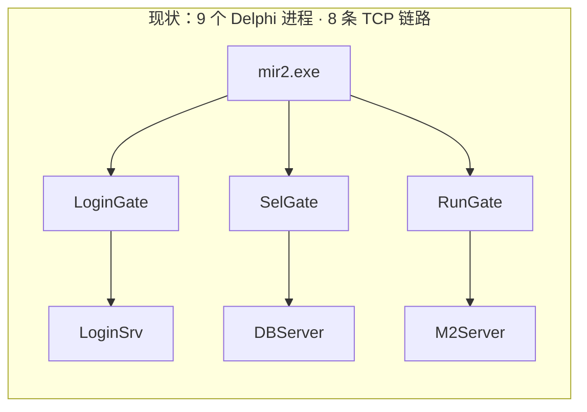
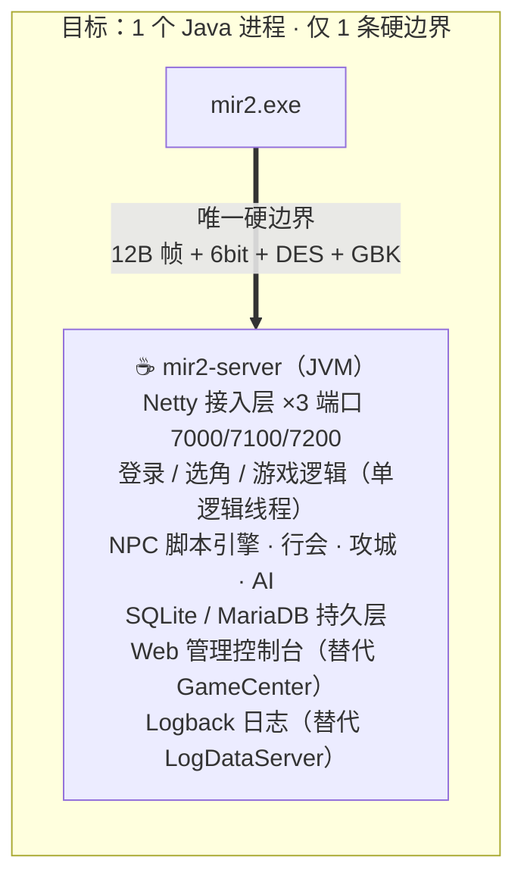
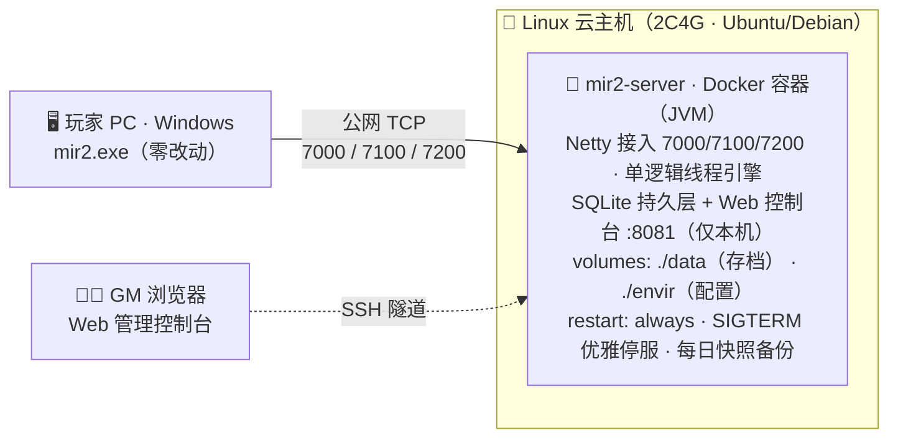

# MIR2 服务端 Java 化迁移 可行性评估报告

*Feasibility Study · Delphi → Java Rewrite*

**综合结论：有条件可行 (GO)** · **技术可行性 8.5 / 10** · **工作量 8–12 人月** · **建议先做 3 周 PoC** · **目标部署平台：Linux** · **合规需保持非商业**

评估对象：将现有 **Delphi 6 服务端（9 个程序，约 14.2 万行 Pascal）**一次性重写为 Java 实现， 要求**现有 mir2.exe 老客户端零改动直连**（逐字节协议兼容），目标支撑**小型社区服（几十～几百在线）**的非商业运营， 最终部署于 **Linux 服务器**（Docker / systemd，方案见第 07 节）。

## 📑 目录

- [01 · 评估结论速览（Executive Summary）](#summary)
- [02 · 评估范围与前提（已确认）（Scope & Constraints）](#scope)
- [03 · 代码取证：兼容边界的硬证据（Code Forensics）](#evidence)
- [04 · 关键洞察：兼容边界收缩效应（Key Insight）](#insight)
- [05 · 逐模块迁移难度矩阵（Module Difficulty Matrix）](#modules)
- [06 · Java 目标架构建议（Target Architecture）](#arch)
- [07 · Linux 部署方案（Linux Deployment）](#linux)
- [08 · 工作量与排期估算（Effort & Timeline）](#effort)
- [09 · 风险登记册（Top 9）（Risk Register）](#risk)
- [10 · 验证策略：如何证明「等价」（Validation Strategy）](#validation)
- [11 · PoC 计划：3 周决策门（Proof of Concept）](#poc)
- [12 · 最终决策建议（Go / No-Go）](#verdict)

**相关文档**：[MIR2 项目分析报告](mir2-analysis-report.md) · [开发计划书](mir2-java-development-plan.md)

---

<a id="summary"></a>

## 01 · 评估结论速览（Executive Summary）

> ### ✓ GO · 有条件可行
>
> 满足 3 个前提：① 先完成 3 周 PoC 验证协议兼容闭环  ② 迁移期冻结玩法改动、以「保真」为第一目标  ③ 全程保持非商业用途

- **8.5** — 技术可行性 · 协议全有源码、加密可复刻、规模要求低
- **7.0** — 工程可控性 · 2.7 万行上帝类 + 行为保真是难点
- **7.5** — 资源与效率 · AI 辅助翻译可大幅压缩周期
- **6.0** — 合规可行性 · 非商业社区服风险可控，禁止商业化

> [!IMPORTANT]
> **一句话结论：**这是一次**低技术风险、中高工程量**的迁移。传奇服务端与客户端之间的协议 （12 字节定长消息 + 6-bit 查表编码 + DES）全部定义在源码 `Common/Grobal2.pas`、`EDcode.pas`、`DES.pas` 中， 可被机械地翻译为 Java——「逐字节兼容」不是黑盒逆向，而是**有完整图纸的照图施工**。 真正的成本不在协议，而在 **M2Server 引擎 9.7 万行玩法逻辑的等价重写与验证**。

| 维度 | 评估结果 | 核心依据 |
| --- | --- | --- |
| 协议兼容（客户端零改动） | ✔ 可达成 | 帧结构/编码/加密均为纯算法实现且源码齐全；Java 原生支持 GBK 字符集与小端字节流 |
| 性能目标（数百在线） | ✔ 大幅富余 | 原 Delphi 单线程引擎即可承载数百人；现代 JVM 单进程轻松支撑数千连接 |
| 数据迁移（角色存档） | ✔ 需专用工具 | Hum.DB / Mir.DB / IdDB 为自定义二进制库，但读写源码（HumDB.pas）完整保留，可编写确定性迁移器 |
| 玩法等价（AI/战斗/脚本） | ⚠ 主要工作量 | 57 个怪物类、59 技能、NPC 脚本引擎、攻城/行会，均需逐一对拍验证 |
| 团队要求 | ⚠ 需要 1 名 Pascal 阅读者 | 以 Delphi 源码为蓝本重写，至少 1 人能流利阅读 Object Pascal（AI 辅助可降低门槛） |

<a id="scope"></a>

## 02 · 评估范围与前提（已确认）（Scope & Constraints）

### ① 迁移范围

**全部 9 个服务端程序**：M2Server、DBServer、LoginSrv、LoginGate / SelGate / RunGate、GameCenter、LogDataServer，彻底告别 Delphi。

### ② 兼容性红线

**严格逐字节兼容**：现有 mir2.exe（1.5 / 1.7.6 客户端）不做任何修改即可连接 Java 服务端，包括二进制协议、6-bit 编码、DES 加密、GBK 字符串。

### ③ 目标规模与平台

**小型社区服**：几十～几百人同时在线，非商业运营。不需要分布式/多区架构，单 JVM 进程即可。**目标部署平台：Linux 服务器**（Docker/systemd，详见第 07 节）。

### ④ 迁移策略

**一次性重写**：以 Delphi 源码为参考蓝本，Java 全新实现。新旧服务不要求长期共存互通（但需并存过渡用于对拍）。

> [!NOTE]
> **范围推论（重要）：**既然 9 个程序**全部**换 Java 且客户端是唯一保留的旧组件，那么「严格兼容」的边界就收窄为 **客户端 ↔ 网关**的三条 TCP 链路；服务端内部（网关↔LoginSrv/DBServer/M2Server 之间）的协议**可以自由重新设计**， 存档格式也可以换成现代数据库。这一点将工作量削减约 20–30%，是本次评估最重要的结构性结论（详见第 4 节）。

<a id="evidence"></a>

## 03 · 代码取证：兼容边界的硬证据（Code Forensics）

以下结论全部来自对仓库源码的直接核验，而非文档转述。这是可行性判断的事实基础：

### 证据 A · 协议帧：12 字节定长记录

```pascal
// Common/Grobal2.pas —— 客户端与服务端共享的"协议宪法"
TDefaultMessage = record
  Recog  : Integer;  // 4B 对象ID（小端）
  Ident  : Word;     // 2B 消息号 CM_/SM_
  Param  : Word;     // 2B 参数1
  Tag    : Word;     // 2B 参数2
  Series : Word;     // 2B 参数3
end; // 共 12 字节，无对齐填充，布局确定
```

另查明内部网关帧头 `TMsgHeader`（18 字节：dwCode/nSocket/wIdent/nLength）。全网 216 个 SM_ 消息号、M2Server 消息泵 51 个 CM_ 命令分支——协议面完全可枚举。**Java 侧用 Netty ByteBuf（LITTLE_ENDIAN）+ 12 字节 codec 即可精确复刻。**

### 证据 B · 编码与加密：纯查表算法

`Common/EDcode.pas`：6-bit 变长编码，依赖两张**硬编码的 256 字节置换表**（EncodeBitMasks / DecodeBitMasks）——照抄常量即得等价实现。

`Common/DES.pas`：标准 DES（IP/CP 置换表、8 组 S-Box 均为教科书值），纯 Pascal 无系统依赖。**Java javax.crypto 原生支持 DES/ECB/PKCS5，或直接翻译该单元保证字节一致。**

用途核验：DES 主要用于登录口令与库文件校验；游戏内消息用 6-bit 编码。

### 证据 C · 存档格式：有源码的自定义文件库

`DBServer/HumDB.pas` 实现了 `TFileHumDB`（Hum.DB 角色索引）与 `TFileDB`（Mir.DB 角色数据）：定长记录 + 文件头（TDBHeader/TIdxHeader，含记录数、删除数、更新时间）+ 索引文件。账号库 IdDB 在 LoginSrv。**格式全部有读写源码，迁移器可写成确定性程序并逐条校验。**

### 证据 D · 线程模型：定时器驱动的伪单线程

`svMain.pas` 用 6 个 TTimer（RunTimer 等）驱动主循环，`UsrEngn` 按固定顺序处理 ProcessHumans → ProcessMonsters → ProcessMerchants → …；Socket 读写由独立线程（DBSocketThread 等）搬运后投递回主循环。**这正是 Java 游戏服务器标准的「单逻辑线程 + 异步 I/O」模型，语义可 1:1 映射。**

### 证据 E · 数据配置：约 100+ 个 GBK 文本文件

M2Server 从 `Envir\` 加载 MonGen（刷怪）、Market_Def（NPC 脚本）、ShopItemList、ItemBind*、DisableMakeItem、行会/攻城配置等百余个文本文件。**Java 的 Charset.forName("GBK") 原生支持读取；建议迁移期保持文件格式不变**（社区 GM 生态的工具链全部依赖这些格式）。

### 证据 F · 服务端代码总量：142,007 行

```
M2Server        96,735 行  // 61 单元（含约25个管理窗体）
DBServer         8,974 行
LoginSrv         6,496 行
三网关合计      12,351 行  // 3,907+3,907+4,537
GameCenter       6,652 行
LogDataServer    3,216 行
Common+SDK       7,583 行
─────────────────────────
合计           142,007 行 Pascal
```

剔除 VCL 窗体/管理界面（约占 25–30%，Java 侧由配置文件 + Web 控制台替代）后，**有效业务逻辑约 10 万行**，其中约 7 万行集中在 M2Server 引擎。

<a id="insight"></a>

## 04 · 关键洞察：兼容边界收缩效应（Key Insight）

「全部 9 程序一起换」这个决策带来一个反直觉的好处——**需要逐字节兼容的边界从 8 条链路收缩到 3 条**：





> 模块间 = 进程内调用，协议自由。

### 必须逐字节兼容（红区）

- **客户端 ↔ LoginGate(7000)**：登录/注册/选区消息
- **客户端 ↔ SelGate(7100)**：角色列表/建删角色
- **客户端 ↔ RunGate(7200)**：全部游戏消息（12B 帧 + 6-bit 编码）
- **GBK 字符串的字节语义**（角色名限长按字节算）

### 可自由重设计（绿区）

- 网关 ↔ LoginSrv/DBServer/M2Server 内部协议（18B TMsgHeader 可废弃）
- Hum.DB / Mir.DB / IdDB 存档 → SQLite/MariaDB
- GameCenter 进程 → 启动脚本 + Web 控制台
- LogDataServer UDP 协议 → SLF4J/Logback

### 必须原样保留（资产）

- Envir\ 全部文本配置与 NPC 脚本（社区 GM 生态依赖）
- 刷怪表 MonGen、商店列表、物品/技能数值表
- 游戏行为语义：掉落率、AI 时机、动作延迟
- 管理员命令与命令行习惯（Command.ini）

<a id="modules"></a>

## 05 · 逐模块迁移难度矩阵（Module Difficulty Matrix）

| 模块 | Pascal 行数 | 难度 | Java 实现方案 | 预估工作量占比 |
| --- | ---: | --- | --- | ---: |
| `LoginGate / SelGate` | 3,907 ×2 | ★★☆☆☆ 低 | 两个网关近乎同构 → 一套 Netty TCP 代理代码 + IP 黑名单/连接限速，客户端侧字节流透传或按帧过滤 | 5% |
| `RunGate` | 4,537 | ★★★☆☆ 中 | 需理解 6-bit 帧的转发缓冲、消息过滤与防加速检测；其余同上 | 5% |
| `LoginSrv` | 6,496 | ★★★☆☆ 中 | 账号验证 + DES 口令 + IdDB 读取（配一次性迁移工具）+ 会话/路由表；VCL 管理界面转 Web | 8% |
| `DBServer` | 8,974 | ★★★☆☆ 中 | Hum.DB/Mir.DB 读写替换为 SQLite/MariaDB DAO；**需编写存档迁移器并逐条校验**；角色创建/删除逻辑直译 | 10% |
| `GameCenter` | 6,652 | ★☆☆☆☆ 极低 | 9 进程合并为 1 JVM 后**天然消失**，保留一键启动脚本 + 轻量 Web 控制台（Spring Boot / Javalin） | 3% |
| `LogDataServer` | 3,216 | ★☆☆☆☆ 极低 | Logback 结构化日志直接替代；如需保留 UDP 汇聚，写一个百行级采集器 | 2% |
| `Common + SDK` | 7,583 | ★★★☆☆ 中 | **最优先翻译**：Grobal2 的 216+ 消息号/常量 → Java 常量类与 POJO；EDcode/DES/HUtil32 直译并配字节级单元测试 | 7% |
| `M2Server（引擎）` | 96,735 | ★★★★★ 极高 | 核心战场，见下方分解 | 60% |

### M2Server 内部工作量分解（约 7 万行有效逻辑）

- **ObjBase.pas（2.7 万行）**→ 拆分为 BaseObject / 战斗公式 / 视野广播 / 消息调度等 10+ 个 Java 类，是全项目最大单点
- **ObjNpc.pas（1.16 万行）**→ NPC 脚本引擎（商人/传送/任务对话），必须兼容现有 Market_Def 脚本语法
- **ObjMon ×4（0.8 万行）**→ 57 个怪物类：策略模式替代深继承，AI 时机需对拍
- **UsrEngn（0.3 万行）**→ 主循环调度，映射为单逻辑线程 tick
- **Castle/Guild/Event/Magic 等**→ 攻城、行会、技能（59 个）逐个移植
- **约 25 个管理窗体**→ 不移植，功能转为 Web 控制台与配置文件

### 翻译映射速查

| Delphi 概念 | Java 对应 |
| --- | --- |
| `record + pointer 算术` | `POJO + ByteBuffer/ByteBuf` |
| `AnsiString(GBK)` | `byte[] + GBK charset（边界转换）` |
| `string[14] 定长` | `字节截断工具类` |
| `TTimer 消息泵` | `ScheduledExecutor tick` |
| `TServer/TClientSocket` | `Netty Bootstrap` |
| `TList/指针链表` | `ArrayList / ConcurrentHashMap` |
| `critical section` | `synchronized / ReentrantLock` |
| `TCustomIniFile` | `commons-configuration` |

<a id="arch"></a>

## 06 · Java 目标架构建议（Target Architecture）

### 技术选型（面向社区服规模，刻意从简）

- **JDK 21 LTS**：虚拟线程处理阻塞 I/O（存档落库、控制台命令），ZGC 低停顿
- **Netty 4.x**：全部网络接入，LengthFieldBasedFrame + 自定义 12B codec，空闲心跳/流量整形现成
- **单逻辑线程游戏循环**：等价复刻 Delphi 定时器语义，保证动作时序确定性与对拍可行性；地图/怪物可后续按分片扩展
- **SQLite（WAL 模式）**：零运维；若团队有运维能力可换 MariaDB。DAO 层用 JDBC 即可，不必上重型 ORM
- **Maven/Gradle 多模块**：protocol / core / gate / db / admin 分模块——沿原进程边界划模块，未来可再拆进程
- **Web 控制台**：Javalin 或 Spring Boot，替代 9 个 VCL 窗体管理工具
- **部署**：**目标平台 Linux**——jlink 定制运行时或 Docker 单容器，2C4G 云主机即可跑满社区服规模，完整方案见第 07 节

### 目录结构草案

```
mir2-server/
├─ protocol/      // Grobal2 直译：216 消息常量、
│                 //   TDefaultMessage codec、EDcode、DES
├─ gate/          // Netty 接入：login/select/game 三端口
├─ auth/          // 原 LoginSrv：账号/会话/路由
├─ character/     // 原 DBServer：建删角色、存档 DAO
├─ engine/        // 原 M2Server 核心（最大模块）
│  ├─ world/      //   地图、视野、广播、tick 循环
│  ├─ object/     //   BaseObject/玩家/怪物57类/NPC
│  ├─ combat/     //   伤害公式、命中、动作时序
│  ├─ script/     //   NPC 脚本引擎(Market_Def 兼容)
│  ├─ guild/      //   行会、攻城、城堡
│  └─ item/       //   物品、掉落、背包、商店
├─ persistence/   // SQLite DAO + 旧库迁移器
├─ admin/         // Web 控制台(原 GameCenter/窗体)
└─ tools/         // 流量录制回放、机器人压测
```

> [!IMPORTANT]
> **架构红利清单（相对 Delphi 现状）：**9 个 Windows 进程 → 1 个跨平台 JVM 进程；18 字节内部网关协议 → 进程内调用； 自定义二进制文件库 → 事务型数据库（存档损坏风险大幅下降）；VCL 管理窗体 → 浏览器管理台； GBK 源码 → UTF-8（仅在协议边界转换 GBK）；单点 exe 部署 → Docker/jlink 标准化交付。 **运维复杂度从「9 个进程 + Windows + 手动启停」降为「1 个容器 + 一条命令」。**

<a id="linux"></a>

## 07 · Linux 部署方案（Linux Deployment）

> [!IMPORTANT]
> **先说结论：**「部署到 Linux」是本次 Java 重写**最直接、最确定的收益**。Delphi 版被 VCL 窗体 / WinAPI / 注册表 / `D:\` 绝对路径锁死在 Windows 上，连上虚拟机都属妥协方案；而 Java 在 Linux 上是主场作战——Netty 走 epoll、JVM 无 GUI 依赖（headless）、systemd/Docker 生态即插即用，还顺手获得 ARM 服务器与容器化的免费红利。**对 Linux 的诉求本身，就是批准这次重写的最强理由之一。**

### 7.1 部署形态选型

| 形态 | 适用 | 评价 |
| --- | --- | --- |
| systemd + jlink 定制运行时 | 单台 VPS、极简运维 | ★★★★ 零外部依赖、开机自启 |
| **Docker 单容器（推荐）** | 默认选择 | ★★★★★ 环境一致、升级回滚秒级 |
| Docker Compose | 连带 MariaDB/Nginx 时 | ★★★★ 一条命令拉起全栈 |
| Kubernetes | — | ★ 社区服严重过度设计，不推荐 |

原则：**单容器 = 单 JVM 进程**（9 个旧进程已合并），SQLite 经数据卷持久化；Web 控制台只绑 `127.0.0.1`，GM 经 SSH 隧道访问。

### 7.2 参考配置（可直接采用）

```
# Dockerfile（多阶段构建，最终镜像约 220MB）
FROM maven:3.9-eclipse-temurin-21 AS build
COPY src /src
RUN mvn -f /src/pom.xml -q package

FROM eclipse-temurin:21-jre-jammy
ENV TZ=Asia/Shanghai
COPY --from=build /src/target/mir2-server.jar /app/
COPY envir/ /app/envir/           # GBK 配置原样保留
EXPOSE 7000 7100 7200
ENTRYPOINT ["java","-XX:MaxRAMPercentage=70","-jar","/app/mir2-server.jar"]

# docker-compose.yml
services:
  mir2:
    image: mir2-server:1.0
    restart: always             # 替代 GameCenter 进程守护
    stop_grace_period: 120s     # 给优雅停服留足时间
    ports: ["7000:7000","7100:7100","7200:7200"]
    volumes:
      - ./data:/app/data        # SQLite 存档卷
      - ./envir:/app/envir      # 配置热改卷
```

### 7.3 Windows → Linux 陷阱清单（全部有解，但必须写进 P0 任务）

| # | 陷阱 | 根因 | 工程对策 |
| --- | --- | --- | --- |
| 1 | **文件名大小写** | NTFS 不区分大小写、ext4 严格区分；脚本引用 `Market_Def\*.txt` 任何大小写不符都会加载失败 | P0 交付 **env-lint** 启动扫描工具：校验 Envir 全部引用完整性与大小写并输出报告；CI 在 Linux 上跑资源加载测试 |
| 2 | **路径分隔符** | 原配置与代码大量使用 `\` 与 `D:\GameOfMir` 绝对路径 | 加载层统一 `java.nio.Path` 归一化；路径全部可配置、禁止硬编码 |
| 3 | **GBK 中文文件名** | 历史资源目录可能含中文命名文件，Linux 文件系统默认 UTF-8 | 迁移脚本一次性重命名为 UTF-8 并生成映射表；**文件名**与**文件内容**（仍按 GBK 解析）分开处理 |
| 4 | **CRLF 行尾** | Windows 产出的文本配置 | 解析器统一 trim `\r`；仓库加 `.gitattributes` 固定 LF |
| 5 | **时区** | Delphi TDateTime 用本地时间；Linux 容器默认 UTC | `TZ=Asia/Shanghai` + 内部时间统一 epoch millis，仅在展示层转时区 |
| 6 | **无头环境** | 原 Delphi 有 25+ 个 VCL 管理窗体，需要桌面 | Java 服务零 GUI（headless），管理全部走 Web 控制台 + 日志 |
| 7 | **进程守护** | 原靠 GameCenter 拉起并守护 9 个进程 | 单进程后天然简化：`restart: always` / systemd `Restart=always` 即可 |

### 优雅停服

SIGTERM → JVM shutdown hook：**关接入 → 全量保存在线角色 → 落库 flush → 退出**；`stop_grace_period: 120s` 留足时间。原版直接杀进程的丢档风险从此根治。

### 备份基线

SQLite 每日 `VACUUM INTO` 快照 + 保留 7 天 + rclone 同步到对象存储/异地；备份后跑一次完整性校验。角色资产是服务器的全部价值。

### 安全基线

ufw 只放行 7000/7100/7200；SSH 密钥登录 + fail2ban；容器非 root 运行；基础镜像定期升级；控制台不暴露公网。

### 监控基线

起步用 uptime-kuma 探活 + Docker 健康检查；进阶 Micrometer 暴露在线人数 / tick 耗时 / 堆内存，Grafana 一张面板看全。



> [!NOTE]
> **附赠红利 · ARM64：**纯 Java 代码 + Netty 天然跨架构，sqlite-jdbc 官方提供 linux-aarch64 原生库——用 `docker buildx --platform linux/amd64,linux/arm64` 一次构建双架构镜像，即可部署到性价比更高的 ARM 云主机（部分云商 ARM 实例约为 x86 半价，2C4G 社区服成本可低至每月几十元）。

<a id="effort"></a>

## 08 · 工作量与排期估算（Effort & Timeline）

估算基准：约 10 万行有效逻辑，其中 60% 属机械翻译（AI 辅助日均可译 1500–2500 行并人工复核）、30% 复杂逻辑（战斗/脚本/攻城，日均 300–500 行）、10% 高难逻辑（时序与字节语义，日均 100–150 行）。

| 阶段 | 周期 | 工作量 |
| --- | --- | --- |
| P0 取证与协议规格化 | 2–3 周 | ≈ 2.5 人周 |
| P1 接入层 + 登录选角 | 4–6 周 | ≈ 5 人周 |
| P2 引擎 MVP（走路/战斗/掉落） | 8–10 周 | ≈ 9 人周 |
| P3 玩法全量（技能/脚本/行会/攻城） | 10–14 周 | ≈ 12 人周 |
| P4 对拍·迁移·压测·灰度 | 4–6 周 | ≈ 5 人周 |

- **28–36 人周** — 纯开发工作量 · +25% 缓冲 → 35–45 人周
- **8–12 人月** — 总投入（含测试缓冲） · AI 辅助工作流前提
- **5–7 个月** — 2 人小组日历工期 · 1 引擎 + 1 工具/测试

| 里程碑 | 验收标准（可演示） | 阶段 |
| --- | --- | --- |
| M1 协议基座 | EDcode/DES/12B 帧的 Java 实现通过与 Delphi 输出的**字节级比对测试**（golden 用例 100% 一致） | P0 |
| M2 真客户端登录 | 未修改的 mir2.exe 完成：登录 → 选区 → 角色列表 → 进入（空）世界 | P1 |
| M3 打怪闭环 | 真实客户端中走路、看见怪物刷新、击杀获得经验与掉落、拾取入包、存档重登不丢 | P2 |
| M4 玩法等价 | 三职业技能全量、NPC 脚本（买卖/修理/传送）、组队/交易/行会/攻城全部可用 | P3 |
| M5 可开服 | 旧服存档迁移校验通过；500 机器人 4 小时压测稳定；灰度玩家 2 周无回滚级缺陷 | P4 |

> [!NOTE]
> **工期压缩变量：**① AI 辅助翻译质量直接决定 P2/P3 速度（本估算已按 AI 辅助计入）； ② 若接受「先开服再补齐」策略，M3 之后即可小范围内测（P3 缩减 30–40% 后置）； ③ 传奇复刻引擎的开源实现（Java/C# 生态均有社区项目）可作为协议与数值的**交叉验证参考**，但需逐项甄别其与 1.5 版行为的差异，不可直接当真源。

<a id="risk"></a>

## 09 · 风险登记册（Top 9）（Risk Register）

### R1 行为保真度偏差（高概率 · 中影响）

掉落概率、命中公式、AI 反应时机、动作延迟（毫秒级 tick 顺序）在重写中最易走样，玩家会以「手感不对」反馈。

> **缓解：**从 Delphi 源码逐函数提取公式为「规格文档」→ 单元测试固定；录制真实流量 golden 对拍；灰度期双服并行观察。

### R2 NPC 脚本引擎兼容（高概率 · 高影响）

Market_Def 脚本语法是社区 GM 生态的事实标准，语句上百种；漏译一条指令即导致某类 NPC 失效。

> **缓解：**P0 期先做**脚本指令全量清单提取**（源码 grep 即可枚举）；引擎按清单逐条实现+用例；未实现指令打 WARN 日志暴露。

### R3 存档迁移损坏（中概率 · 高影响）

Hum.DB/Mir.DB/IdDB 二进制库字段多（角色装备/技能/任务/仓库），迁移工具字段错位将造成玩家资产损失。

> **缓解：**迁移器基于 HumDB.pas 源码结构体逐字段映射；迁移后做**记录数核对 + 抽样字段 diff + 双向往返校验**；保留原库只读备份。

### R4 GBK 字节语义陷阱（高概率 · 低影响）

Delphi string[14] 按**字节**限长，GBK 中文占 2 字节；Java String 按 UTF-16 计数。名称截断/过滤/排序若按字符数实现即越界。

> **缓解：**协议层统一 byte[] + GBK；封装 ByteString 工具类；对名称/聊天类消息专项字节边界测试。

### R5 时序与节奏漂移（中概率 · 中影响）

TTimer 触发间隔、SendTick 延迟投递等依赖 Windows 消息泵时序；Java 线程调度差异可能改变动作手感或引发竞技不同步。

> **缓解：**坚持单逻辑线程 tick 模型；所有延迟统一走 tick 调度器（禁用散落的 sleep/异步）；对拍录制帧间隔分布。

### R6 范围蔓延与顺手优化（高概率 · 中影响）

重写时极易顺手「改进」数值/加功能，导致永远比不完、对拍失真、工期失控。

> **缓解：**明文约定「迁移期行为冻结」：只做等价翻译，所有改进进 backlog 留到 V2；用里程碑 M1–M5 门禁推进。

### R7 Pascal 阅读能力（中概率 · 高影响）

团队若完全无人能读 Object Pascal，取证与规格提取质量将大幅下降，AI 误译难以发现。

> **缓解：**至少 1 名成员达到「能读懂+能调试」水平（2–4 周可训）；关键公式一律双通道验证（源码推导 + 运行期抓包对照）。

### R8 法律合规（低概率 · 极高影响）

传奇 IP 归属盛趣/Wemade；即便非商业，公开运营社区服仍处灰色地带，商业化（卖装备/充值）则明确违法。

> **缓解：**坚持私密社区、不收费、不公开拉新、不分发客户端资源；服务器仅自用研究；接受随时下线预案。

### R9 Linux 平台差异（高概率 · 低影响）

ext4 严格区分文件名大小写（NTFS 不区分）、原配置含反斜杠路径与 GBK 中文文件名、CRLF 行尾——Envir 资源原样搬到 Linux 会出现「配置加载不到」类故障，且多为运行期才暴露。

> **缓解：**P0 期交付 env-lint 启动校验工具（扫描 Envir 引用完整性/大小写/行尾）；文件名一次性转 UTF-8 留映射表；全部路径经 java.nio 归一化（详见第 07 节陷阱清单）。

<a id="validation"></a>

## 10 · 验证策略：如何证明「等价」（Validation Strategy）

### 四层验证体系

- **L1 字节级单测：**EDcode/DES/12B codec 对拍 Delphi 输出（录制固定输入输出对），必须 100% 一致
- **L2 协议一致性套件：**51 个 CM_ 命令逐个构造请求，比对 SM_ 响应序列（动态字段归一化后 diff）
- **L3 影子对拍：**同一客户端操作流同时喂给 Delphi 服与 Java 服，自动 diff 状态快照（血量/背包/坐标/经验）
- **L4 机器人压测：**协议级机器人 500 并发，跑图/打怪/交易混合负载 4–8 小时，观察内存/延迟/死锁

### 灰度切换清单

- ✅ Delphi 旧服保持热备，保留 15 分钟内回滚能力
- ✅ 存档迁移分两批：先历史沉淀角色（静默校验），后活跃角色（玩家登录即验）
- ✅ 邀请 10–20 名老玩家封闭测试 2 周，重点收集「手感差异」反馈
- ✅ 开服首月双写日志：关键经济事件（交易/掉落/充值替代物）人工抽查对账
- ❌ 禁止在灰度期修改任何数值——所有调整进入观察清单统一决策

```
# tools/ 下的三件套（P0 期间先行开发，是后续一切验证的基础）
traffic-recorder # 挂在 Delphi 服前录制真实客户端会话 → golden 流量文件
protocol-replayer # 将 golden 流量重放到 Java 服，diff 响应序列（CI 集成）
bot-swarm # 协议级机器人集群：走路/打怪/买卖/聊天脚本化压测
```

<a id="poc"></a>

## 11 · PoC 计划：3 周决策门（Proof of Concept）

在投入全部 8–12 人月之前，先用一个**最小闭环验证最大的两个不确定性**（协议兼容、引擎骨架可行性）。PoC 通过即可消除约 50% 的整体风险。

| 周次 | 任务 | 产出 |
| --- | --- | --- |
| `W1` | 翻译 Grobal2 消息常量 + EDcode + DES + 12B codec；编写字节级对拍单测；搭建 Netty 接入 | protocol 模块 + 20 组 golden 用例全绿 |
| `W2` | 实现登录/选角链路（LoginGate+SelGate+LoginSrv+DBServer 最小路径）；SQLite 建角色 | 真 mir2.exe 登录进入空地图（M2 里程碑提前验证） |
| `W3` | 单逻辑线程 tick + 地图加载 + 移动广播 + 1 种近战怪 + 击杀掉落拾取 | 完整「登录→走路→打怪→捡装备→重登不丢」闭环演示 |

> [!IMPORTANT]
> **PoC 通过标准（Go/No-Go 决策门）：**① 未修改的 mir2.exe 全程无断线无乱码； ② 协议层 20 组 golden 用例字节级一致；③ 移动/攻击手感经 3 名以上老玩家盲测「无差异」； ④ 单机 50 机器人稳定跑 1 小时；⑤ **PoC 全程在 Linux 容器环境构建与运行**，让大小写/编码/时区等平台差异在决策门之前暴露。 任一条不达标 → 回到本报告第 09 节风险登记册定位后再决策。

<a id="verdict"></a>

## 12 · 最终决策建议（Go / No-Go）

### ✓ 推荐路径（本报告主结论）

- ✅ **GO，但从 PoC 起步**：3 周 PoC → 决策门 → 5 阶段推进
- ✅ 团队配置：1 名游戏服务端主力（需能读 Pascal）+ 1 名工具/测试，5–7 个月日历工期
- ✅ 架构从简：单 JVM 模块化单体 + SQLite + Web 控制台，刻意保留 9→1 的合并红利；部署目标 Linux/Docker（第 07 节）
- ✅ 验证先行：traffic-recorder 三件套在 P0 就位，全程对拍驱动
- ✅ 合规底线：非商业、私密社区、不分发客户端资源

### ✕ 不建议的情形

- ❌ 团队无人愿意读 Delphi 源码，想「黑盒逆向协议」重写——成本和风险将失控（本源码库的最大价值就是免逆向）
- ❌ 计划商业化运营——法律风险不可接受，本评估不覆盖该前提
- ❌ 期望 1–2 个月速成——最小诚实工期就是 5 个月起，压缩只会牺牲对拍与迁移质量
- ❌ 迁移期顺手大改玩法——等价性验证将失去基准，见风险 R6

> [!WARNING]
> **最后重申法律边界：**本评估以「技术学习 + 私密社区」为前提。传奇 IP 与美术资源版权归盛趣游戏/Wemade 所有； Java 服务端即便完全自研，公开运营、商业化收费、分发客户端补丁均可能构成侵权。请始终将项目保持在小范围研究用途内，并做好随时下线的准备。

> ### 下一步：批准 PoC（3 周 / 约 1 人月）
>
> PoC 交付物：protocol 模块 + golden 对拍 20 例 + 真客户端打怪闭环演示 + 风险复审清单
> 具体执行方案见 [《开发计划书》](mir2-java-development-plan.md)（30 周 · 6 决策门 · 240 人日）

---

*☕ MIR2 → JAVA FEASIBILITY STUDY*  
分析对象：ivanmissu/MIR2 服务端 · 评估基线：9 程序 / 142,007 行 Pascal · 兼容边界：mir2.exe 零改动 · 目标平台：Linux (Docker)  
报告生成于 2026-09-18 · 结论基于源码静态取证 · 前置阅读：[MIR2 项目分析报告](mir2-analysis-report.md)
